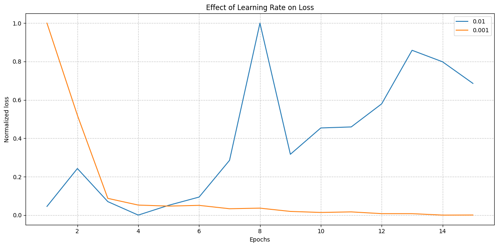

# Academic Success Potential Solution Notebook 
This is a notebook written in python which serves as a potential solution to the <a href="https://www.kaggle.com/competitions/playground-series-s4e6">kaggle competition</a>. 
It has a bunch of code that can be used as a template as well for your own kaggle comp attempts as I roughly outline the steps I take when working on a new kaggle comp. 

# Interesting Observation 

Just wanted to share a lil experiment I did with leaerning rates. So it was kind of an acident where I increased the lr from 0.001 to 0.01 and this essentially caused the algo to overshoot past the minimum point of the loss function. To learn more about learning rates check <a href="https://machinelearningmastery.com/understand-the-dynamics-of-learning-rate-on-deep-learning-neural-networks/">this</a> out. 

